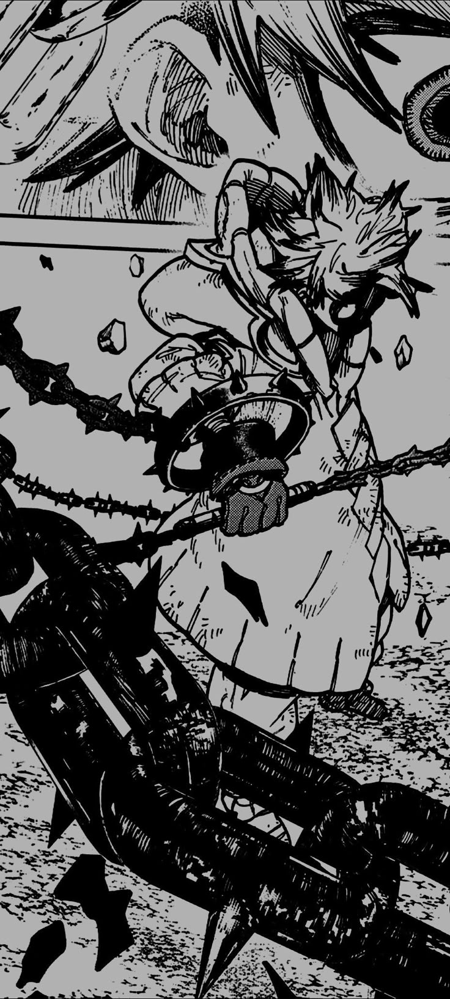

<h1 align="center">Hi, I'm Rubén</h1>

<h4 align="center">
  I'm a second-year Software Development student interested in Full-Stack and native Android development.
</h4>

##

### About Me

- Currently studying my second year in Multi-platform Application Development (DAM).
- I like working on both frontend and backend to build complete and functional applications.
- I’m especially interested in native Android development.
- I enjoy learning by building projects and refining how I structure code.

---

### My Tech Stack

  <picture>
    <source media="(prefers-color-scheme: dark)" srcset="./assets/java_white.svg">
    <source media="(prefers-color-scheme: light)" srcset="./assets/java_black.svg">
    
  </picture>
  <picture>
    <source media="(prefers-color-scheme: dark)" srcset="https://cdn.simpleicons.org/kotlin/FFFFFF">
    <source media="(prefers-color-scheme: light)" srcset="https://cdn.simpleicons.org/kotlin/000000">
    
  </picture>
  <picture>
    <source media="(prefers-color-scheme: dark)" srcset="https://cdn.simpleicons.org/html5/FFFFFF">
    <source media="(prefers-color-scheme: light)" srcset="https://cdn.simpleicons.org/html5/000000">
    
  </picture>
  <picture>
    <source media="(prefers-color-scheme: dark)" srcset="./assets/css3_white.svg">
    <source media="(prefers-color-scheme: light)" srcset="./assets/css3_black.svg">
    
  </picture>
  <picture>
    <source media="(prefers-color-scheme: dark)" srcset="https://cdn.simpleicons.org/python/FFFFFF">
    <source media="(prefers-color-scheme: light)" srcset="https://cdn.simpleicons.org/python/000000">
    
  </picture>
  <picture>
    <source media="(prefers-color-scheme: dark)" srcset="https://cdn.simpleicons.org/git/FFFFFF">
    <source media="(prefers-color-scheme: light)" srcset="https://cdn.simpleicons.org/git/000000">
    
  </picture>
  <picture>
    <source media="(prefers-color-scheme: dark)" srcset="https://cdn.simpleicons.org/github/FFFFFF">
    <source media="(prefers-color-scheme: light)" srcset="https://cdn.simpleicons.org/github/000000">
    
  </picture>
  <picture>
    <source media="(prefers-color-scheme: dark)" srcset="./assets/oracle_white.svg">
    <source media="(prefers-color-scheme: light)" srcset="./assets/oracle_black.svg">
    
  </picture>
  <picture>
    <source media="(prefers-color-scheme: dark)" srcset="https://cdn.simpleicons.org/raspberrypi/FFFFFF">
    <source media="(prefers-color-scheme: light)" srcset="https://cdn.simpleicons.org/raspberrypi/000000">
    
  </picture>

---
### GitHub Stats

  

#####

  

