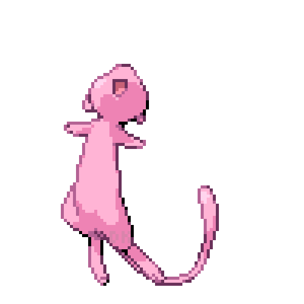

## Hola, soy Rubén

Estudiante de **2º DAM** interesado en el desarrollo **full-stack**.

Mi interés principal es el desarrollo full-stack, con una atención especial en la creación de aplicaciones nativas para **Android**. Disfruto el proceso de integrar el *frontend* con el *backend* para construir soluciones de software funcionales y completas.

Busco constantemente aplicar mis conocimientos en proyectos que me permitan crecer en este campo.

:)

---

### 🧰 Lenguajes y Herramientas:

<!--
**Ruben-am/Ruben-am** is a ✨ _special_ ✨ repository because its `README.md` (this file) appears on your GitHub profile.

Here are some ideas to get you started:

- 🔭 I’m currently working on ...
- 🌱 I’m currently learning ...
- 👯 I’m looking to collaborate on ...
- 🤔 I’m looking for help with ...
- 💬 Ask me about ...
- 📫 How to reach me: ...
- 😄 Pronouns: ...
- ⚡ Fun fact: ...
-->
